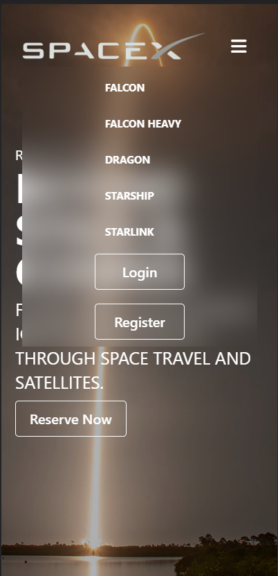
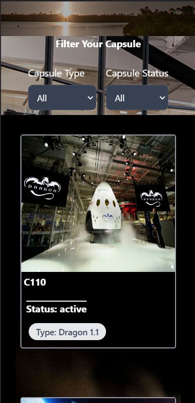
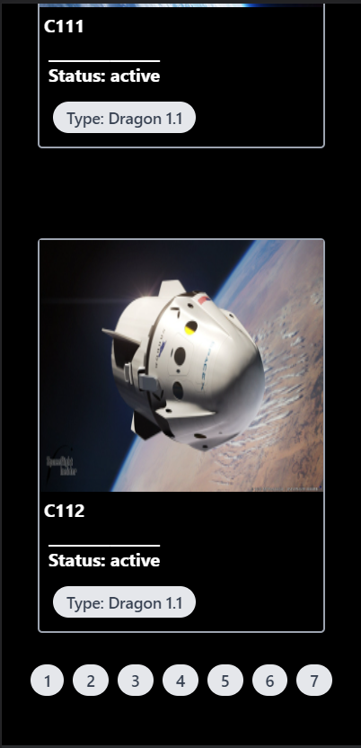

## SpaceX

- Assignment SpaceX Demo
- Video Demo :- [Click here](https://www.veed.io/view/348ba112-8b15-47ac-8bb2-ce8a465c4bca?panel=share)
- Code Walkthrough :-  [Click here](https://www.veed.io/view/7de4a938-1e9f-430c-a7f4-3a7aff513061?panel=share)

<hr/>

<hr/>

## Features

- Clean and Responsive UI
- Parallex Effect 
- Filter by Status and Type of Capsule
- Pagination with 3 items per page
- Login and Register with PHP
- Unit Testing with Vitest

## Tech Stack

- Vite ( for build and dev server )
- ReactJs
- Tailwind CSS
- Vitest ( for unit testing )
- PHP ( for Authentication )
- MySql ( for Database )

## How to run locally

- clone the repo
- create folder name auth in httdocs ( for xampp ) or www ( for wamp )
- copy the files of php folder in auth folder
- run the apache server from xampp or wamp


- ```cd spacex```
- run ```npm install``` 
- run ```npm run dev```
- website will be live 
  
## How to run tests

- run ```npm run test```

## ScreenShots


<p align="center">


</p>
<br>
<p align="center">


</p>


